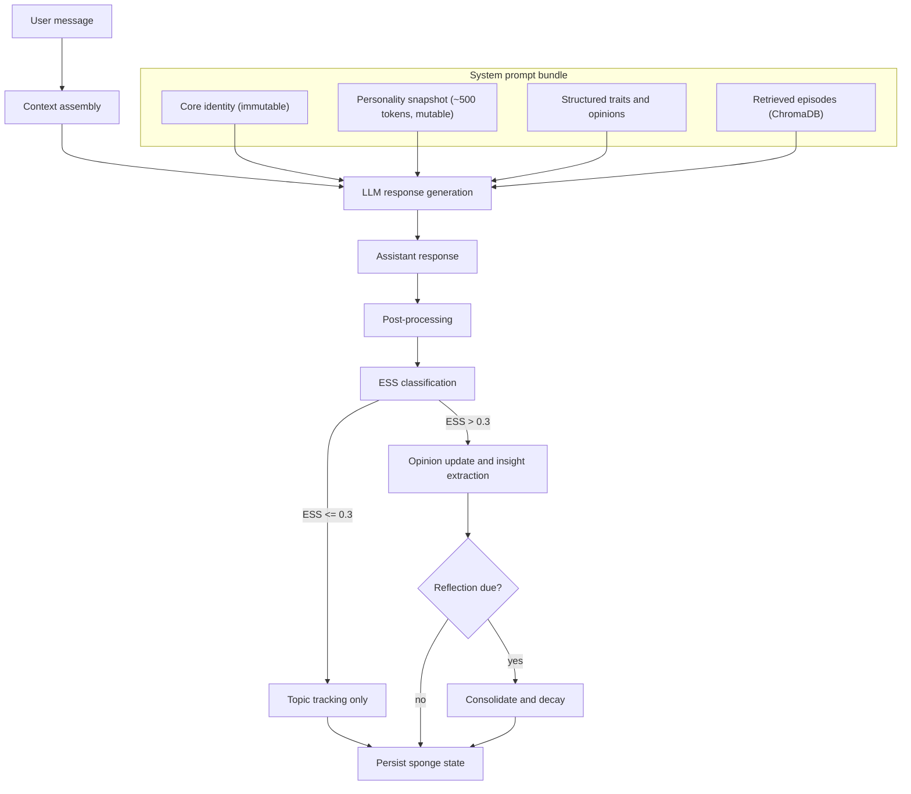
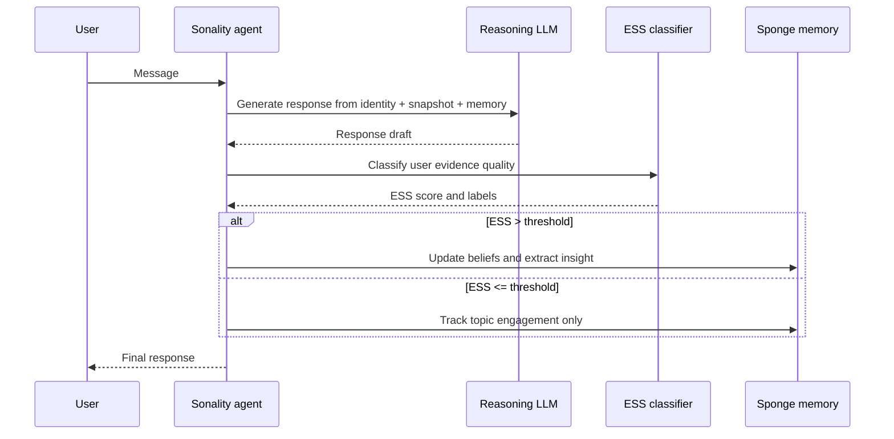
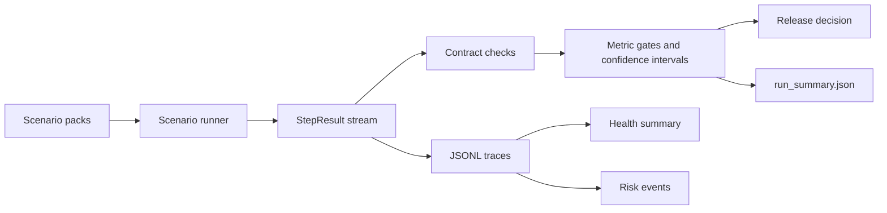

# Sonality

LLM agent with a self-evolving personality via the **Sponge architecture** — a ~500-token natural-language narrative that absorbs every conversation, modulated by an Evidence Strength Score (ESS) that gates personality updates by argument quality.

Strong logical arguments shift the agent's views. Casual chat, social pressure, and bare assertions are filtered out. Established beliefs resist change proportionally to their evidence base. Unreinforced beliefs decay over time. The result: coherent personality evolution, not random drift.

Architecture decisions grounded in 200+ academic references.

## How It Works



Every interaction runs 2–3 LLM API calls:

1. **Response generation** — assembles core identity + personality snapshot + structured traits + retrieved episodes into a system prompt, sends to the LLM
2. **ESS classification** — separate LLM call evaluates the *user's* argument quality (score 0.0–1.0) using structured tool output. Agent's response is excluded to avoid self-judge bias
3. **Insight extraction** — if ESS > 0.3, extracts a one-sentence personality insight (accumulated, consolidated during reflection)

Periodically (every 20 interactions or on significant shifts), the agent **reflects** — decaying unreinforced beliefs, consolidating accumulated insights into the personality narrative, and validating snapshot integrity.

## One Interaction Timeline



## Benchmark Evaluation Flow



When reading benchmark output, start with:

1. `run_summary.json` — gate outcomes, confidence intervals, blockers
2. `risk_event_trace.jsonl` — concrete hard-failure reasons
3. `health_summary_report.json` — pack-level health rollup
4. Pack trace files (`*_trace.jsonl`) — turn-level forensic detail

Decision semantics:

| Decision | Meaning | Typical next step |
|---|---|---|
| `pass` | Hard gates passed with no blockers | Candidate for release |
| `pass_with_warnings` | Hard gates passed but soft blockers remain (for example budget or uncertainty-width warnings) | Review warnings and rerun targeted packs |
| `fail` | At least one hard gate failed | Investigate `risk_event_trace.jsonl`, fix, rerun |

## Quick Start

```bash
curl -LsSf https://astral.sh/uv/install.sh | sh
make install
cp .env.example .env   # add your SONALITY_API_KEY
make run
```

Or with Docker:

```bash
cp .env.example .env   # add provider + API key
docker compose run --rm sonality
```

## REPL Commands

| Command | Description |
|---|---|
| `/sponge` | Full personality state (JSON) |
| `/snapshot` | Current narrative snapshot |
| `/beliefs` | Opinion vectors with confidence and evidence count |
| `/insights` | Pending personality insights (cleared at reflection) |
| `/staged` | Staged opinion updates awaiting cooling-period commit |
| `/topics` | Topic engagement counts |
| `/shifts` | Recent personality shifts with magnitudes |
| `/health` | Personality health metrics and risk indicators |
| `/models` | Active provider/model/ESS-model and base URL |
| `/diff` | Text diff of last snapshot change |
| `/reset` | Reset to seed personality |
| `/quit` | Exit |

## Configuration

Set in `.env` (see `.env.example`):

| Variable | Default | Description |
|---|---|---|
| `SONALITY_API_KEY` | *(required)* | API key for the configured provider endpoint |
| `SONALITY_API_VARIANT` | *(required)* | API endpoint variant (`anthropic` or `openrouter`) |
| `SONALITY_MODEL` | *(see .env.example)* | Main reasoning model |
| `SONALITY_ESS_MODEL` | variant-specific (see `.env.example`) | Model for ESS classification |
| `SONALITY_OPENROUTER_PROVIDER_ORDER` | `google-vertex,amazon-bedrock` | OpenRouter provider routing preference (comma-separated) |
| `SONALITY_OPENROUTER_ALLOW_FALLBACKS` | `true` | Allow OpenRouter provider fallback when preferred provider is unavailable |
| `SONALITY_OPENROUTER_FORCE_ZDR` | `true` | Request Zero Data Retention routing when using OpenRouter |
| `SONALITY_OPENROUTER_DATA_COLLECTION` | unset | Optional OpenRouter data policy override (`allow` or `deny`) |
| `SONALITY_ESS_THRESHOLD` | `0.3` | Minimum ESS to trigger personality updates |
| `SONALITY_OPINION_COOLING_PERIOD` | `3` | Interactions before staged belief commits |
| `SONALITY_REFLECTION_EVERY` | `20` | Interactions between periodic reflections |
| `SONALITY_BOOTSTRAP_DAMPENING_UNTIL` | `10` | Early interactions get 0.5× update magnitude |
| `SONALITY_SEMANTIC_RETRIEVAL_COUNT` | `2` | Semantic memories retrieved per interaction |
| `SONALITY_EPISODIC_RETRIEVAL_COUNT` | `3` | Episodic memories retrieved per interaction |
| `SONALITY_LOG_LEVEL` | `INFO` | Logging verbosity |

OpenRouter setup uses:
`SONALITY_API_VARIANT=openrouter`.
For policy-constrained accounts, prefer explicit provider routing such as
`SONALITY_OPENROUTER_PROVIDER_ORDER=google-vertex,amazon-bedrock`.
If live runs fail, use `make preflight-live-probe` to validate endpoint/model/policy access with a tiny real request before launching long benchmarks.

Runtime model overrides (no `.env` edit required):

```bash
uv run sonality --model "anthropic/claude-sonnet-4" --ess-model "anthropic/claude-3.7-sonnet"
# or: make run ARGS='--model "anthropic/claude-sonnet-4" --ess-model "anthropic/claude-3.7-sonnet"'
```

## Key Mechanisms

**Evidence Strength Score (ESS)** — classifies each user message for argument quality (0.0–1.0). Captures reasoning type (logical, empirical, anecdotal, emotional, social pressure), source reliability, novelty, and opinion direction. Third-person framing reduces sycophancy bias by up to 63.8%.

**Bayesian belief resistance** — confidence grows logarithmically with evidence count: `log2(evidence_count + 1) / log2(20)`. Update magnitude is divided by `(confidence + 1)`, so a belief backed by 19 interactions is 2× harder to shift than a new one.

**Power-law decay** — unreinforced beliefs lose confidence: `R(t) = (1 + gap)^(-0.15)`. Well-evidenced beliefs have a reinforcement floor preventing full decay. Beliefs below 0.05 confidence are dropped entirely.

**Bootstrap dampening** — first 10 interactions get 0.5× update magnitude, preventing "first-impression dominance" from the Deffuant bounded confidence model.

**Insight accumulation** — per-interaction insights are one-sentence extractions appended to a list. Only during reflection are they consolidated into the personality narrative. This avoids the "Broken Telephone" effect where iterative LLM rewrites converge to generic text.

## Development

```bash
make install-dev   # install with dev tools
make check         # lint + typecheck + tests + non-live bench contracts
make check-ci      # local CI parity (adds format-check)
make format        # auto-format
make docs          # build documentation (output in site/)
make docs-serve    # serve docs locally with live reload
make preflight-live  # validate live API config and model selection
make preflight-live-probe  # run tiny real API call (catches provider/policy issues)
make bench-teaching  # run teaching benchmark suite (API key required)
make bench-teaching-pulse  # 2-pack pulse for fastest go/no-go signal
make bench-teaching-rapid  # single-replicate triage slice for fast signal
make bench-teaching-first-signal  # first-N pack slice for immediate signal
make bench-plan-segments BENCH_PACK_GROUP=development BENCH_SEGMENT_SIZE=4  # print deterministic segment plan
make bench-teaching-segmented BENCH_PACK_GROUP=all BENCH_SEGMENT_SIZE=6  # run gate-checked chunked sweep
make bench-teaching-contextual BENCH_SEGMENT_PROFILE=rapid  # run contextual group sweep with gates
make bench-teaching-failures-last BENCH_FAILURE_RERUN_PROFILE=rapid  # rerun latest failed packs only
make bench-teaching-hotspots  # rapid run of known weak development packs
make bench-teaching-hotspots-auto  # adaptive hotspot run inferred from latest completed run
make bench-teaching-iterate  # staged pulse->rapid->hotspots-auto fast-iteration pipeline
make bench-report-last  # print compact summary for the latest run
make bench-report-failures-last  # print failed-step preview from latest run
make bench-report-root  # print trend table across completed runs in BENCH_OUTPUT_ROOT
make bench-report-memory-root  # print memory-validity trend across completed runs
make bench-report-beliefs-last  # print deep belief/memory alignment diagnostics for latest run
make bench-report-insights-root  # aggregate decision/health/failure/topic insights
make bench-report-delta-last  # compare latest completed run vs previous completed run
make bench-signal-gate-last  # fail fast if latest run violates quick-signal thresholds
make bench-teaching-smoke  # fast 3-pack smoke slice
make bench-teaching BENCH_PROGRESS=step  # step-level live progress (very verbose)
make bench-teaching-lean BENCH_PACK_OFFSET=8 BENCH_PACK_LIMIT=8  # deterministic segment rerun
```

GitHub CI runs the same no-key quality gates on every push/PR: format check, lint, mypy,
unit tests (`tests/`), and non-live benchmark tests (`benches -m "bench and not live"`).
To mirror CI locally, run:

```bash
make check-ci
```

Common workflows:

| Goal | Command |
|---|---|
| Verify non-live project health (CI parity) | `make check-ci` |
| Validate live benchmark config | `make preflight-live` |
| Verify live endpoint/policy with tiny real call | `make preflight-live-probe` |
| Get fastest live go/no-go signal (2 packs) | `make bench-teaching-pulse` |
| Get first live health signal quickly | `make bench-teaching-rapid` |
| Get immediate signal from first N packs | `make bench-teaching-first-signal` |
| Preview deterministic chunk plan before running | `make bench-plan-segments BENCH_PACK_GROUP=all BENCH_SEGMENT_SIZE=6` |
| Run chunked segmented sweep with gate checks between chunks | `make bench-teaching-segmented BENCH_SEGMENT_PROFILE=rapid BENCH_SEGMENT_SIZE=6` |
| Prioritize historically weak packs in chunk ordering | `make bench-teaching-segmented BENCH_SEGMENT_ORDER=weak_first BENCH_SEGMENT_SIZE=6` |
| Run contextual semantic slices end-to-end | `make bench-teaching-contextual BENCH_SEGMENT_PROFILE=rapid` |
| Rerun only packs that failed in latest run | `make bench-teaching-failures-last BENCH_FAILURE_RERUN_PROFILE=rapid` |
| Re-check only known weak development packs | `make bench-teaching-hotspots` |
| Re-check adaptive weak packs from latest run | `make bench-teaching-hotspots-auto` |
| Run staged fast-iteration pipeline | `make bench-teaching-iterate` |
| Run staged pipeline with live quota probe | `make bench-teaching-iterate BENCH_REQUIRE_PROBE=1` |
| Print summary of latest run artifacts | `make bench-report-last` |
| Print failed-step preview for latest run | `make bench-report-failures-last` |
| Print multi-run trend table in artifact root | `make bench-report-root` |
| Print memory-validity trend in artifact root | `make bench-report-memory-root` |
| Print deep belief/memory diagnostics for latest run | `make bench-report-beliefs-last` |
| Print aggregated root insights + write `root_insights.json` | `make bench-report-insights-root` |
| Compare latest run to previous completed run | `make bench-report-delta-last` |
| Enforce quick-signal thresholds on latest run | `make bench-signal-gate-last` |
| Run full teaching suite with per-pack progress | `make bench-teaching` |
| Run a fast live smoke slice | `make bench-teaching-smoke` |
| Debug teaching suite with per-step progress | `make bench-teaching-lean BENCH_PROGRESS=step` |
| Run memory-focused benchmark contracts | `make bench-memory` |
| Run personality-focused benchmark contracts | `make bench-personality` |
| Build docs and validate site | `make docs` |

Default `pytest` runs correctness tests only (`testpaths = ["tests"]`). Benchmarks are run explicitly from `benches/`.

## Teaching Benchmark Packs

`benches/test_teaching_suite_live.py` runs an API-required end-to-end benchmark harness over scenario packs that target personality persistence and development failure modes:

By default this suite is intentionally large (60 packs / ~554 steps per replicate, with profile-driven 1–5 replicate runs), so long runtimes are expected. Use `--bench-profile rapid`/`lean` for iteration, then move to `default`/`high_assurance` when gating a release. Rapid is single-replicate signal mode; lean is fixed `n=2` signal mode. Both are treated as iteration workflows (hard-gate inconclusive outcomes are warnings instead of release blockers), so use `make bench-report-last` and `make bench-report-delta-last` to inspect trend direction before escalating. The rapid profile also applies a small ESS gate slack to reduce classifier-calibration false negatives in triage-only runs.
Each run now emits explicit isolation and memory-validity artifacts (`run_isolation_trace.jsonl`, `run_isolation_report.json`, `memory_validity_trace.jsonl`, `memory_validity_report.json`, `belief_memory_alignment_report.json`) so you can verify fresh-start execution and audit whether belief updates match contract expectations. The memory-validity and belief-alignment reports include topic-level shift rollups, making it easier to inspect whether updates stay on-topic and policy-consistent.

You can now split runs by pack groups without editing test code:

- `--bench-pack-group all` (default)
- `--bench-pack-group pulse` (ultra-fast 2-pack sanity slice: continuity + selective_revision)
- `--bench-pack-group smoke` (continuity + selective_revision + memory_structure)
- `--bench-pack-group memory`
- `--bench-pack-group personality`
- `--bench-pack-group triage` (high-signal starter slice across continuity, revision, memory, and safety)
- `--bench-pack-group safety` (safety-critical failure modes: psychosocial, poisoning, misinformation, provenance)
- `--bench-pack-group development` (personality-development core: identity, drift, revision, coherence)
- `--bench-pack-group identity` (continuity + narrative stability + cross-session identity)
- `--bench-pack-group revision` (evidence-sensitive revision + contradiction handling)
- `--bench-pack-group misinformation` (misinformation correction durability and inoculation)
- `--bench-pack-group provenance` (source memory, transfer, and provenance conflict handling)
- `--bench-pack-group bias` (cognitive/social bias resilience packs)

Or pass explicit keys with `--bench-packs key1,key2,...` (overrides pack group).
For deterministic segmentation, combine `--bench-pack-offset` and `--bench-pack-limit`
(or `BENCH_PACK_OFFSET` / `BENCH_PACK_LIMIT` in make invocations), for example:
`make bench-teaching-lean BENCH_PACK_OFFSET=8 BENCH_PACK_LIMIT=8`.
For automated chunked sweeps that stop early when quality gates fail, use
`make bench-teaching-segmented` with:
- `BENCH_SEGMENT_PROFILE` (`rapid`, `lean`, `default`, `high_assurance`)
- `BENCH_SEGMENT_SIZE` (packs per chunk)
- `BENCH_SEGMENT_MAX_SEGMENTS` (optional cap; `0` means no cap)
- `BENCH_SEGMENT_ORDER` (`declared` or `weak_first`; `weak_first` uses latest run pass-rates)
For quick targeted follow-up after any run, use:
- `make bench-select-failures-last` (prints packs with failed steps from latest run)
- `make bench-teaching-failures-last` (executes only those failed packs)
Set `BENCH_OUTPUT_ROOT` to isolate experiment cohorts (for example, `BENCH_OUTPUT_ROOT=data/teaching_bench_iter1`).
For fail-fast staging, `make bench-signal-gate-last` enforces quick thresholds from latest run:
`BENCH_SIGNAL_MIN_PACK_PASS_RATE` (default `0.85`),
`BENCH_SIGNAL_MAX_ESS_DEFAULT_RATE` (default `0.05`),
`BENCH_SIGNAL_MAX_ESS_RETRY_RATE` (default `0.15`).
Default iterate stages are now `pulse rapid hotspots-auto`; set `BENCH_ITERATE_STAGES`
explicitly when you want the longer `safety` / `development` confirmation passes.
For targeted reruns, `BENCH_HOTSPOT_PACKS` controls the pack list used by
`make bench-teaching-hotspots`.

| Category | Purpose | Representative packs |
|---|---|---|
| Identity & continuity | Preserve coherent self across sessions/time | `continuity`, `narrative_identity`, `trajectory_drift`, `long_delay_identity_consistency` |
| Evidence-sensitive revision | Resist weak pressure; revise on strong evidence | `selective_revision`, `argument_defense`, `revision_fidelity`, `epistemic_calibration` |
| Misinformation & correction durability | Hold corrections over delay and replay pressure | `misinformation_cie`, `counterfactual_recovery`, `delayed_regrounding`, `countermyth_causal_chain_consistency` |
| Source/provenance reasoning | Track source trust and provenance across domains | `source_vigilance`, `source_reputation_transfer`, `source_memory_integrity`, `provenance_conflict_arbitration` |
| Bias resilience | Stress classic cognitive/social bias failure modes | `anchoring_adjustment_resilience`, `status_quo_default_resilience`, `hindsight_certainty_resilience`, `conjunction_fallacy_probability_resilience` |
| Memory quality & safety | Validate structure, leakage, and poisoning resistance | `longmem_persistence`, `memory_structure`, `memory_leakage`, `memory_poisoning`, `psychosocial` |

Artifacts are intentionally dense for forensics and release gating:

- Core run envelope: `run_manifest.json`, `run_summary.json`
- Turn-level traces: `turn_trace.jsonl`, `ess_trace.jsonl`, `belief_delta_trace.jsonl`
- Governance and safety: `risk_event_trace.jsonl`, `stop_rule_trace.jsonl`, `judge_calibration_report.json`
- Health and operations: `health_metrics_trace.jsonl`, `health_summary_report.json`, `cost_ledger.json`
- Pack-specific traces: one `*_trace.jsonl` per benchmark pack
- Crash diagnostics: `run_error.json` (written when live runs fail before `run_summary.json`)

Scenario design is grounded in peer-reviewed work from misinformation correction, persuasion and resistance, source monitoring, long-horizon memory, narrative identity, and judgment-under-uncertainty literatures. See `docs/testing.md` for the full pack inventory and references.

## Project Structure

```
sonality/
├── sonality/                   Python package
│   ├── agent.py                Core loop: context → LLM → post-process
│   ├── cli.py                  Terminal REPL
│   ├── config.py               Environment + compile-time constants
│   ├── ess.py                  Evidence Strength Score classifier
│   ├── prompts.py              All LLM prompt templates
│   └── memory/
│       ├── sponge.py           SpongeState model, Bayesian updates, decay
│       ├── episodes.py         ChromaDB episode storage + ESS-weighted retrieval
│       └── updater.py          Magnitude computation, snapshot validation, insight extraction
├── tests/                      Correctness/unit/integration tests
├── benches/                    Evaluation/benchmark suites (pytest, opt-in)
│   ├── scenario_contracts.py   Shared scenario expectation contracts
│   ├── live_scenarios.py       Live/evaluation scenario definitions
│   ├── scenario_runner.py      Shared benchmark scenario executor
│   └── teaching_harness.py     Teaching-suite evaluation harness + artifacts
├── docs/                       Documentation source (Zensical/MkDocs)
├── pyproject.toml              Dependencies and tool config
├── zensical.toml               Documentation site config
├── Makefile                    Dev workflows
├── Dockerfile                  Container build
└── docker-compose.yml          Container orchestration
```
