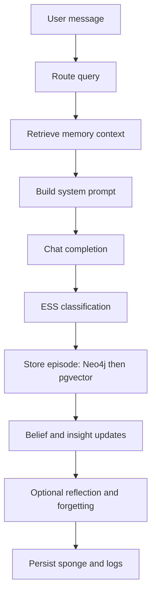

## Data Flow

This page describes one interaction through the current Path A architecture.

## Retrieval Step

1. Router classifies query category.
2. Agent executes category-specific retrieval:
   - graph traversals (belief/topic/temporal as needed)
   - pgvector derivative search
   - optional semantic feature search
3. Results are deduplicated and optionally reranked.
4. Utility signals are written back to graph nodes.

## Storage Step

1. Create derivative chunks and embeddings.
2. Write episode + derivatives + links in one Neo4j transaction.
3. Insert derivative embeddings into PostgreSQL.
4. If pgvector write fails, graph episode is deleted (rollback).

## Reflection Step

When reflection triggers:

- gather recent episodes from graph
- run LLM-guided decay/entrenchment checks
- run consolidation and forgetting passes
- validate and persist the updated narrative snapshot

## Persistence

Persistent state:

- `data/sponge.json` and `data/sponge_history/`
- PostgreSQL tables (`derivatives`, `semantic_features`, `stm_state`, ...)
- Neo4j graph nodes/edges (`Episode`, `Derivative`, `Belief`, `Segment`, ...)
