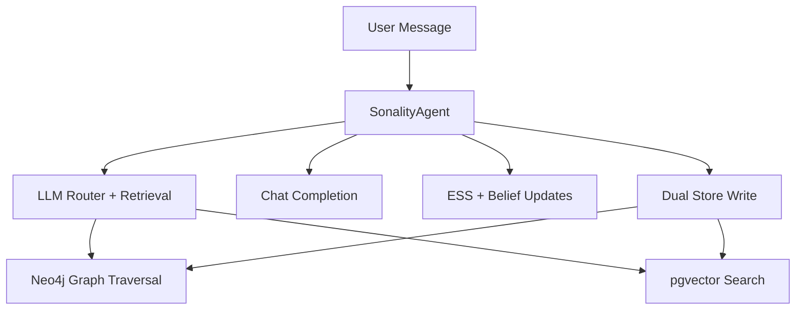

# Sonality Docs

Sonality is a personality-evolving agent built on:

- one OpenAI-compatible provider abstraction (`chat` + `embeddings`)
- dual memory storage (Neo4j + PostgreSQL/pgvector)
- LLM-first routing, belief updates, and reflection

## Architecture Snapshot

## Start Here

- [Getting Started](getting-started.md)
- [Configuration](configuration.md)
- [Architecture Overview](architecture/overview.md)
- [Memory Model](architecture/memory-model.md)
- [Data Flow](architecture/data-flow.md)
- [API Reference](api-reference.md)
